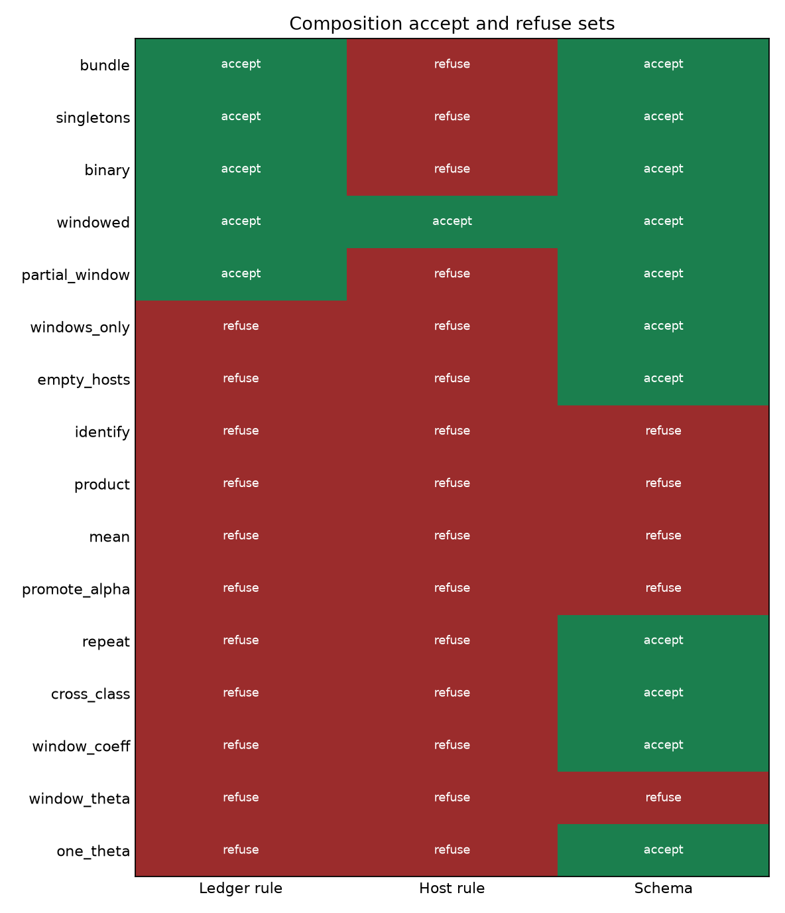
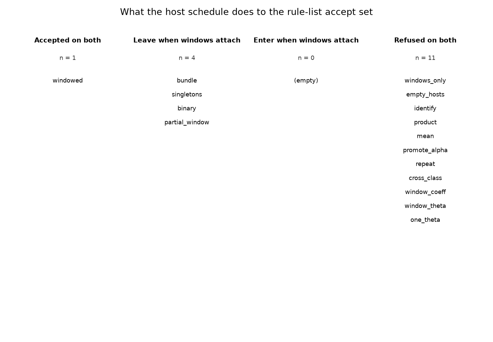
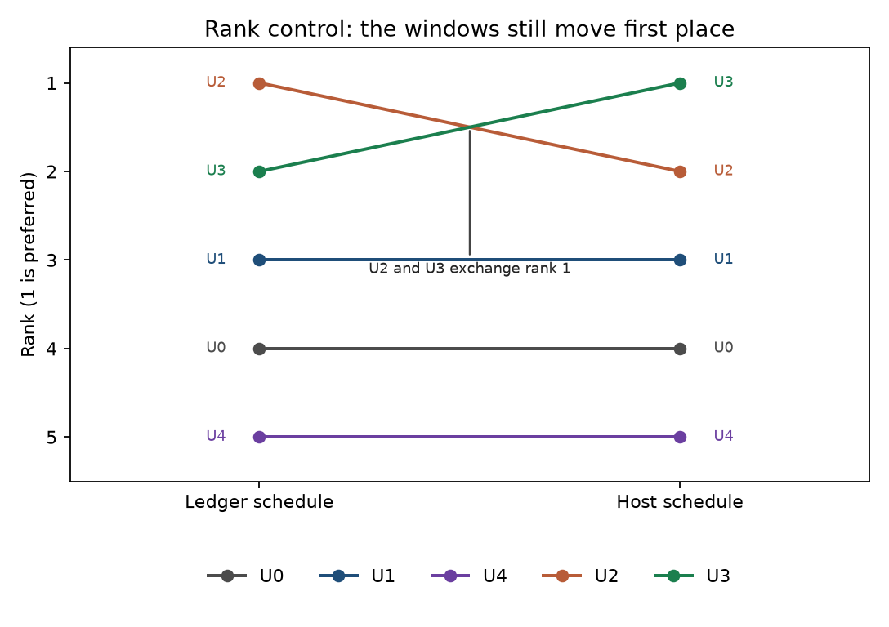

# Host infection windows that re-rank channel–profile composition without merging into Θ

**Thesis #29. Computational research thesis**  
**Depends on:** Thesis #22 and Thesis #23  
**Author:** Kelechi Emeka Ogbonna  
**Correspondence:** kelechiogbonna300@gmail.com · https://github.com/cloudynirvana/thesis-29-host-windows-channel-profile-composition  
**Date:** 21 September 2026  
**Format:** B.Sc. project chapters (Nile University style), written as a computational methods manuscript  
**Status:** A joint reading of two declared objects on one composition catalogue, plus a seeded rank control. Not a measurement of infection.  
**Citation style:** numbered Vancouver. A `doi:` field appears only where Crossref returned the record.  
**DOI:** none for this document. Do not invent one.

---

## Title page

**HOST INFECTION WINDOWS THAT RE-RANK CHANNEL–PROFILE COMPOSITION WITHOUT MERGING INTO Θ**

BY

**KELECHI EMEKA OGBONNA**

A COMPUTATIONAL RESEARCH THESIS  
(IN-SILICO JOINT READING OF A COMPOSITION RULE LIST AND A HOST-WINDOW SCHEDULE)

SUBMITTED AS A CITEABLE MANUSCRIPT FOR JOURNAL / THESIS HANDOFF

PROJECT CONFLUENCE  
INDEPENDENT COMPUTATIONAL RESEARCH

SUPERVISOR: not appointed for this deposit

SEPTEMBER 2026

---

## Declaration

I, Kelechi Emeka Ogbonna, declare that this computational research thesis was carried out by me. The accept and refuse sets, the schema decisions, the structure ranks, and the kinetic digest reported here were produced by `sim/windowed_compose.py` at seed 20260929. The seed governs two hundred shuffles of the rank control. The composition decisions are deterministic. The numbers are not wet-lab measurements and not patient outcomes. No DOI, ORCID, or journal acceptance was invented for this document. No composition decision was copied from Thesis #22, and no rank was copied from Thesis #23. The kinetic literals and the window endpoints are declared inputs. They were not fitted in this deposit.

_________________________     _______________________  
Kelechi Emeka Ogbonna         Date

---

## Abstract

Can declared host infection windows that re-rank immunometabolic hypotheses also change which named observation-channel compositions remain legal Disease Profiles, without promoting either the windows or the channel coefficients into Θ?

They can. Sixteen composition files were scored by a structural rule list and by a schedule clause. The structural list is the disjoint-union contract: the operator is disjoint union, the quotient and the combiner are null, θ is empty, channel identifiers do not repeat, and no map coefficient is a window-derived name. That list does not read the evidence schedule. Seven files pass it. The schedule clause asks a further question: is every identifier in the active schedule a member of the file's hosted-evidence list? Hosting is set membership. It does not write a coefficient.

On the ledger schedule the evidence is E_lac, E_ck, and E_sup. The accept set has five files: bundle, singletons, binary, windowed, and partial_window. On the host schedule the same ledger identifiers remain, and the declared windows W_I = [1.5, 2.5] and W_M = [10, 12] are added. The accept set then has one file, windowed. Four files leave. The enter set is empty. A file that hosts only the windows stays refused, because the ledger identifiers are still missing. A file that hosts every window and also writes k_inf or k_host into θ stays refused. A file that hosts every window and admits a one-parameter mechanism stays refused.

The JSON Schema of the legal contract accepts eleven files. It accepts the same eleven under either schedule, because the schema does not receive the schedule. It accepts a repeated channel identifier and a cross-class join, which the rule list refuses. It also accepts an otherwise legal file whose DOI is the synthetic string 10.1234/not-a-real-record. That string was not written to disk. The rule list refuses it, because the string is absent from the Crossref snapshot of 21 September 2026.

SHA-256 of the canonical kinetic JSON is cf5be3430e25f75d9f87810c789195a3225388b0a9973de7970ec3890a70313e at the start, after the catalogue, after the refused promotion, and after a name check that resubmits the seven legal pairs. The refused promotion would have replaced σ = 0.12 with the host supply budget 0.20 and would have added k_inf = 1/2 and k_host = 1/9. The guard returns the original object.

A rank control on five declared structure records, using the joint key of Thesis #23, still moves first place from U2 to U3 when the windows are attached. Two hundred shuffles at the seed above leave both orders unchanged. The ranker does not take θ as an argument. The order was recomputed from the declared records. It was not read from that deposit's results file.

Research only. Not a medical device, not clinical decision support, not a dose, and not a cure.

---

## Keywords

disease profile; observation channel; disjoint union; host infection window; composition legality; schedule clause; theta digest; research only

---

## Table of Contents

DECLARATION  
ABSTRACT  
Table of Contents  
List of tables and figures  

CHAPTER ONE. INTRODUCTION  
1.1 Background to the study  
1.2 STATEMENT OF RESEARCH PROBLEM  
1.3 JUSTIFICATION OF STUDY  
1.4 AIM AND OBJECTIVES OF THE STUDY  
1.5 SIGNIFICANCE OF THE STUDY  
1.6 SCOPE OF THE STUDY  

CHAPTER TWO. LITERATURE REVIEW  
2.1 A legal profile is already a refusal list  
2.2 A host window is already a ranking input on another object  
2.3 Fusion does not name the coefficient  
2.4 A schema is a weaker contract than a rule list  
2.5 What this deposit does not reopen  

CHAPTER THREE. MATERIALS AND METHODS  
3.1 Design, and the separation of the two clauses  
3.2 Channels, factors, and the profile shell  
3.3 The structural rule list  
3.4 The schedule clause  
3.5 Sixteen files  
3.6 Schema, snapshot, and the unsnapshotted DOI  
3.7 The kinetic object and the refused promotion  
3.8 Rank control  
3.9 What was not done  

CHAPTER FOUR. RESULTS  
4.1 Seven files pass the structural list  
4.2 The ledger schedule accepts five  
4.3 The host schedule accepts one  
4.4 The schema does not see the windows  
4.5 Hosting the windows does not pardon a bad file  
4.6 The digest does not move  
4.7 The windows still re-rank the structures  
4.8 Checks  

CHAPTER FIVE. DISCUSSION, CONCLUSION AND RECOMMENDATION  
5.1 Discussion  
5.2 Conclusion  
5.3 Recommendation  

REFERENCES  
DISCLAIMER  

---

## List of tables and figures

**Table 3-1.** Channels in the catalogue.  
**Table 3-2.** Evidence schedules.  
**Table 3-3.** The sixteen composition files.  
**Table 3-4.** Structural codes.  
**Table 3-5.** Kinetic values in Θ.  
**Table 3-6.** Declared host windows.  
**Table 3-7.** Structure records used in the rank control.  
**Table 3-8.** Sort terms of the joint key.  
**Table 4-1.** Accept sets.  
**Table 4-2.** Rule-list codes and schema decision for each file.  
**Table 4-3.** Files whose code list changes when the windows are attached.  
**Table 4-4.** Digest checkpoints.  
**Table 4-5.** Primary ranks on the two schedules.  
**Table 4-6.** Other keys on the host schedule.

**Figure 4-1.** Accept and refuse calls on the sixteen files.  
**Figure 4-2.** Movement of the rule-list accept set.  
**Figure 4-3.** Rank control. U2 and U3 exchange first place.

Figures are diagnostics from `sim/windowed_compose.py`. They are not measured cohorts and not assays.

---

# CHAPTER ONE

## 1.0 INTRODUCTION

### 1.1 Background to the study

A Disease Profile, in the sense fixed by Thesis #3, is an export of named questions, named observables, and an explicit list of what must not become a therapeutic parameter [3]. A named observation channel, in the sense fixed by Thesis #8, is one map with one coefficient and a sentence that says the coefficient stays out of θ [4]. Thesis #15 showed that several such maps can sit in one multi-observation file and still be illegally collapsed into a single symbol [5]. Thesis #22 then named the legal operator. The legal composition is the disjoint union of the channel records. The composition record names the factors, leaves θ empty, and names neither a quotient nor a combiner. Identification, a product, an arithmetic mean, promotion of one coefficient into θ, a repeated channel identifier, and a join across two disease classes are refused [1].

That contract is about channels. It does not mention a host. Thesis #10 had already required that lactate bounds, a checkpoint label, and a host supply budget stay outside the kinetic vector of an immunometabolic cartoon [6]. Thesis #14 had already treated infection timing as a constraint on a delay graph rather than as a new rate to be fitted [7]. Thesis #23 put those two stores on one page and asked a ranking question. Five structure records share one frozen kinetic vector. A joint key that can see two declared windows, [1.5, 2.5] and [10, 12], changes which record is preferred. A guard that is offered the window midpoints as new kinetic names refuses the offer, and the digest of the kinetic vector does not change [2].

The two deposits can be left side by side and still fail to answer the question a later reader will ask. Thesis #22 says which compositions of channels are legal. Thesis #23 says that host windows re-rank immunometabolic structures. The missing sentence is whether those same windows also change which of the compositions remain legal. The way to test the sentence is to hold one catalogue of composition files fixed, to score it twice, and to hash the kinetic object before and after.

May's warning applies before either object is given a clinical name. An equation borrowed from a neighbouring argument still has to be the equation the prose describes [8]. Saltelli and colleagues make the same demand of any model that might be mistaken for a decision [9]. Platt's standard is useful here because the catalogue was built so that a single witness can settle the question: one file that is accepted on one schedule and refused on the other is enough to say that the windows change the accept set [10]. Box's reminder is the other half. A rule list that has not been given a file it ought to refuse has not been tested [11].

### 1.2 STATEMENT OF RESEARCH PROBLEM

Can declared host infection windows that re-rank immunometabolic hypotheses also change which named observation-channel compositions remain legal Disease Profiles, without promoting either the windows or the channel coefficients into Θ?

The working form is narrow. There is a finite catalogue of composition files. There is a structural rule list whose clauses are those of Thesis #22, restated in this script so they can be applied to the catalogue [1]. There is a schedule clause that this deposit adds: a file hosts an evidence identifier or it does not. There are two schedules. The ledger schedule carries three immunometabolic identifiers. The host schedule carries those three and the two windows of Thesis #23 [2]. There is one kinetic object of length 7, and there is a guard that refuses to edit it. The windows change the legal set if the accept set under the host schedule differs from the accept set under the ledger schedule. They have been promoted into Θ if the SHA-256 digest of the canonical kinetic JSON differs at any checkpoint, or if an accepted file lists a window-derived name among its map coefficients or inside θ.

Collapse, if it happens, is a property of this catalogue and these two clauses. It is not a statement about every model of infection, and it is not a statement about every way of joining data [8,16].

### 1.3 JUSTIFICATION OF STUDY

Thesis #22 already records that the operator string `disjoint_union` is not self-certifying, and it leaves host windows in their own deposit [1,2]. Thesis #23 already records that the windows move first place from U2 to U3, and it leaves channel composition alone [2]. Each deposit is locally careful. The gap is the missing joint catalogue. Without it, a reader can treat a legal profile and a window-ranked hypothesis as two descriptions of one legality, or can assume that a window which is forbidden to enter Θ is also forbidden to change a composition decision.

The study is justified as a comparison of two predicates on one file. The structural predicate reads the operator, the factors, the channel identifiers, and θ. The schedule predicate reads a list of hosted names against a list of evidence names. A window endpoint that enters only the second predicate cannot be recovered from the first. A coefficient that enters θ fails the first predicate on both schedules. Those are reasons to compute both accept sets and to hash Θ on the way through [8,9].

The study is also justified as a test of a schema. Thesis #22 already found that a JSON Schema of the legal contract can accept a repeated identifier and a cross-class join [1,21]. This deposit asks the further question whether that schema, extended with a hosted-evidence array, becomes sensitive to which schedule is active. If it does not, the schema accept set is the wrong object to quote when the claim is about windows.

The study is not justified as a device, a diagnostic, or a claim that a hosted identifier is a treated patient [9]. It does not replace the propositions about disjoint union in Thesis #22, and it does not replace the ranking propositions in Thesis #23.

### 1.4 AIM AND OBJECTIVES OF THE STUDY

The aim is to decide, on the catalogue in Chapter Three, whether the declared host windows change the set of composition files that remain legal Disease Profiles, while the kinetic digest stays fixed.

The objectives are:

1. Restate the disjoint-union rule list and apply it to sixteen composition files.
2. Score the same files under a ledger schedule and under a host schedule that adds W_I and W_M.
3. Record the accept set, the refuse set, and the files that leave or enter when the windows are attached.
4. Validate the same files against a JSON Schema that does not receive the schedule.
5. Offer the window midpoints to Θ as new keys, refuse that offer, and record the digest.
6. Recompute the joint rank of the five structure records, as a control that the windows still do the ranking job on their own object.

Non-aims. Recomputing the Fisher diagonals of Thesis #22. Re-integrating the immunometabolic ordinary differential equation of Thesis #10. Re-propagating the delay graph of Thesis #14. Estimating a window from a registry. Ranking interventions. Reading an accepted file as a diagnosis.

### 1.5 SIGNIFICANCE OF THE STUDY

The useful product is a pair of sets that can fail to match in public. If the accept sets differ, the windows change composition legality on this catalogue. If they match, the windows are ranking inputs and nothing more, on this catalogue. Either outcome is a result about these two clauses. The outcome in Chapter Four is that they differ, and that the difference is a shrinking: four files leave, and the enter set is empty.

There is a second product inside the same script. The digest is a single hex string at four checkpoints. A window can change a legality decision and still fail to become a kinetic name. That split is the point of refusing the promotion.

What the significance is not: a clinical rule, a reason to treat a channel name as an assay, or a replacement for either parent deposit [1–7].

### 1.6 SCOPE OF THE STUDY

In scope. Sixteen composition files. Two evidence schedules. One structural rule list. One schedule clause. One JSON Schema, version `1.3.0-windowed-compose`. One kinetic object of seven keys. One refused promotion. Five structure records and four rank keys. Two hundred shuffles at seed 20260929. A Crossref snapshot consulted on 21 September 2026, used as a membership test for DOI fields inside the profile files.

Out of scope. Patient records. Animal data. A fitted window. A dose. An antimicrobial schedule. A checkpoint-blockade schedule. Synthesis of particles. A copy of the 2022 amylase table. Any identification of the channel names with laboratory measurements.

---

# CHAPTER TWO

## 2.0 LITERATURE REVIEW

### 2.1 A legal profile is already a refusal list

Structural identifiability, in the sense Bellman and Åström gave it, asks whether the map from parameters to outputs can be inverted [12]. Cobelli and DiStefano separated that question from the weaker question of whether a numerical fit looks stable [13]. Hermann and Krener made the dual point for observability: a state that never moves an output is not recovered by giving the output a new name [52]. The composition problem in this deposit is narrower than either of those theorems. It asks which files may be called a join. It does not ask whether a coefficient inside an accepted file is globally identifiable.

The profile likelihood is the tool that would ask the second question [14,46]. A flat profile along a hyperbola is what a product of two coefficients looks like when the data see only the product [42]. Villaverde, Barreiro, and Papachristodoulou review the structural side for dynamical models and are careful about what a rank does not say [15]. Wieland and colleagues separate structural from practical identifiability in the same spirit [47]. Chis, Banga, and Balsa-Canto compare the software that implements those tests and show that the implementations disagree often enough to make the choice of test part of the claim [53]. This deposit does not run that software. The maps are not integrated. The legality decision is a finite check on a file. Citing the identifiability literature here is a boundary: a legal composition is not yet an identifiable parameter, and an identifiable parameter is not yet a legal composition [12,14,15].

Gutenkunst and colleagues showed that sloppy spectra are common in systems-biology models, so a large sensitivity in one direction can coexist with a flat direction in another [44]. Catchpole and Morgan gave a criterion for parameter redundancy that catches the same phenomenon in a statistical model [43]. Both results are reasons to refuse a quotient. They are not, by themselves, a composition operator. Thesis #22 supplied the operator. This chapter does not re-derive it [1].

### 2.2 A host window is already a ranking input on another object

The immunometabolic cartoon that supplies the kinetic literals is old in its shape. Kuznetsov, Makalkin, Taylor, and Perelson fitted a tumour–immune oscillator and treated parameters as kinetic [23]. Kirschner and Panetta wrote an immunotherapy model in the same family [24]. de Pillis, Radunskaya, and Wiseman published a validated cell-mediated model and were explicit that validation was against the cartoon's own data, not against a composition file [25]. Eftimie, Bramson, and Earn reviewed the non-spatial models and left the spatial and the observational questions open [63]. Altrock, Liu, and Michor reviewed the broader mathematical literature and treated coupling across scales as a modelling choice, not as an automatic join [64]. Kitano's short overview of systems biology, and Noble's argument that no level is privileged, both warn against reading a cartoon coefficient as if it were the only cause in the file [59,60]. None of those papers is a Disease Profile. They are why a seven-key kinetic object can be frozen and then left unread by a ranker.

The ledger names come from a metabolic literature that this deposit does not reanalyse. Warburg described aerobic glycolysis as a feature of tumour cells [29]. Vander Heiden, Cantley, and Thompson restated the metabolic requirements of proliferation [30]. Gatenby and Gillies asked why the aerobic route is maintained [55]. Pavlova and Thompson listed metabolic hallmarks without turning the list into a parameter vector [54]. Lactate itself has a cellular literature: Fischer and colleagues reported inhibition of human T cells by tumour-derived lactic acid [31]; Colegio and colleagues reported macrophage polarisation by the same metabolite [32]; Brand and colleagues tied LDHA-associated lactate to blunted surveillance by T and NK cells [33]; Chang and colleagues described metabolic competition in the microenvironment as a driver of progression [56]. O'Neill, Kishton, and Rathmell wrote the immunologist's guide to that interface [26]. Pearce and Pearce reviewed the pathways that change between activation and quiescence [27]. Buck, Sowell, Kaech, and Pearce described metabolic instruction of immunity as a programme rather than as a single rate [28]. Checkpoint blockade has its own reviews [34,57,78,79], and the tumour immune microenvironment is a different diagram again [36,58,80]. Hanahan and Weinberg is a list of hallmarks, which is useful as a warning: a list is not a join [35].

Infection enters that literature as context. de Martel and colleagues estimated a global cancer burden attributable to infection [37]. Grivennikov, Greten, and Karin, and earlier Coussens and Werb, treated inflammation as a participant in tumour progression [38,65]. Bodey, Buckley, Sathe, and Freireich quantified a relationship between circulating leukocytes and infection in acute leukemia [40]. Hotchkiss, Monneret, and Payen reviewed sepsis-induced immunosuppression [39]. Microbiome papers have since tied commensals to therapy response [66,81,84]. Fearon, Arends, and Baracos reviewed cachexia as a host state with its own mechanisms [67]. Competing-risks methods exist for the case where more than one event can close a record [68,69,82]. This deposit uses none of those data. The windows are declared intervals. Dechter, Meiri, and Pearl's temporal constraint networks are the formal neighbour: an interval can constrain a schedule without becoming a rate [41]. Thesis #14 made that choice for a delay graph [7]. Thesis #23 made it for a rank key [2]. This deposit asks what the same intervals do to a composition file.

### 2.3 Fusion does not name the coefficient

Bareinboim and Pearl named the data-fusion problem as a causal question about when samples drawn under different regimes may be combined [16]. Pearl and Bareinboim later separated external validity from the licence to transport a conclusion across populations [45]. Those papers give conditions. They do not define a Disease Profile, and they do not put a window midpoint into a kinetic vector.

The sensor-fusion literature is the engineering neighbour, and it is easy to misread. Hall and Llinas introduce multisensor fusion as an architecture with levels [17]. Bloch reviews combination operators and classifies them [18]. Khaleghi, Khamis, Karray, and Razavi review the state of the art and keep the choice of operator visible [19]. Castanedo reviews techniques again and does not collapse them into one default [70]. The relevant point for this catalogue is small. An operator has a name. Disjoint union is one name. A product is another. An arithmetic mean is another. Writing the first name on a file that performs the second is the failure Thesis #22 already isolated [1]. Attaching a host window does not, by itself, choose among those operators.

FAIR principles ask that a record be findable and reusable, which is a demand on the file, not a demand that every identifier become a parameter [20]. Linked-data arguments have the same limit. Bechhofer and colleagues wrote that linked data are not enough for scientists, because a link does not state the claim [75]. A hosted-evidence array is a list of names. It becomes a claim only when a rule says what the list must cover.

### 2.4 A schema is a weaker contract than a rule list

JSON Schema is a language for the shape of a document [21]. JSON itself is a text format [22]. A schema can require an empty array, a null quotient, and a constant operator. It can require each channel to carry a status. Those are local types. Uniqueness of an identifier across an array, equality of a disease identifier across factors, and coverage of an evidence schedule that is not stored in the file are different demands. Pezoa, Reutter, Suarez, Ugarte, and Vrgoč are explicit that the schema language has a semantics for the document it is given [21]. A schedule that never enters the document is outside that semantics.

Minimum-information standards make the same distinction in biology. MIRIAM asks for annotation sufficient to identify a model [62]. MIASE asks for the information needed to rerun a simulation [48]. SBML is a carrier for the model [71]. The OBO Foundry and the Ontology for Biomedical Investigations coordinate vocabularies so that a label can be looked up [73,74]. Courtot and colleagues made the systems-biology case for controlled vocabularies [72]. Sansone and colleagues asked for interoperable bioscience data and treated the container as part of the result [61]. Nosek and colleagues, the reproducibility manifesto, and Ioannidis's argument about false findings are reasons to publish the rule that refused a file, not only the file that passed [49–51]. Faria and colleagues asked for minimum information in bio–nano reports, which is why an assay scalar is on the non-parameter list even though no assay table is stored [83].

Hong, Ovchinnikov, Pogudin, and Yap's SIAN, and the profile-reduction work of Maiwald and colleagues, are examples of software that answers a different question [76,77]. They are cited so the omission is visible. This deposit's decision procedure is the rule list in Chapter Three.

### 2.5 What this deposit does not reopen

Thesis #3 remains the definition of the profile shell [3]. Thesis #8 remains the definition of a single channel [4]. Thesis #15 remains the multi-observation file that is not yet a legal join [5]. Thesis #22 remains the disjoint-union contract and the place where the Fisher calculation for three linear maps was done [1]. Thesis #10 remains the place where the kinetic literals and the ledger constants were fixed as a refusal problem [6]. Thesis #14 remains the place where the window endpoints were fixed as constraints [7]. Thesis #23 remains the place where the joint rank key was defined [2].

This deposit recomputes the rank, because a control that was not run would be a citation pretending to be a result. It does not recompute the Fisher matrix. The numbers 3819.4444, 9155.5556, and 4000 belong to Thesis #22's loadings. They are not results of this catalogue.

---

# CHAPTER THREE

## 3.0 MATERIALS AND METHODS

### 3.1 Design, and the separation of the two clauses

The deposit has three layers. The first is a catalogue of sixteen composition files and a validator. The second is a guard on a frozen kinetic object. The third is a rank control on five structure records, included so that a reader can see the windows still move a rank on the object Thesis #23 defined. All three layers are produced by `sim/windowed_compose.py`. The seed is 20260929. It governs the permutation audit in Section 3.8. The accept and refuse decisions do not draw random numbers.

Legality is the conjunction of two clauses. The structural clause is schedule-blind. The schedule clause reads one evidence list. A file is accepted under a schedule when both clauses are empty of complaints. The clauses are written as separate functions. The ranker's signature does not include θ. The structural function's signature does not include the schedule.

Schema `1.3.0-windowed-compose` is local to this repository. It follows the shape of schema `1.2.0-compose` [1]. It does not edit that file, and it does not edit schema `1.1.0-multiobs` [5]. `additionalProperties` is forbidden. A schema-legal file must name the operator `disjoint_union`, set the quotient and the combiner to null, leave θ empty, and carry a `hosted_evidence` array. The schema does not check that the array covers a schedule. The schedule is not a field of the file.

The disease identifier on every file in the catalogue is `named-channel-class-unspecified`, except the cross-class file, whose second factor carries `other-channel-class`. The shared identifier names a class of maps. It does not name a person, a stage, or a hospital record.

### 3.2 Channels, factors, and the profile shell

A channel is a record: an identifier, a symbol, a map-coefficient name, a sentence saying what is observed, the status `not_in_theta`, a factor identifier, a source prior, and a refusal sentence. A factor is a named bundle of channel identifiers, carrying one source prior and one disease-class identifier. A profile is the Thesis #3 shell, plus the channels, plus one composition record, plus the hosted-evidence list [3].

**Table 3-1.** Channels in the catalogue.

| Channel | Symbol | Coefficient | Prior | What the channel records |
| --- | --- | --- | --- | --- |
| `ch_amyl_map` | y_A | alpha | T08 | A declared saturating map of a substrate coordinate. Not an inhibition percentage. |
| `ch_spectral` | y_S | beta | T15 | A declared spectral contrast. Not a copied reporter loading. |
| `ch_compartment` | y_C | gamma | T15 | A declared compartment indicator. Not a vesicle count. |

The bundle uses two factors. One factor holds the amylase-shaped channel. The other holds the spectral and compartment channels together. The singletons file splits the same three channels into three factors. The binary file keeps only the spectral and compartment channels, as two factors. A one-channel file is not a composition under this schema, because a join needs two factors. Thesis #8 remains the place where a single channel is defined [4].

The coefficient names are the identifiers `alpha`, `beta`, and `gamma`. They are not the numerals 0.62, 1.15, and 2.40. Those numerals are the generating values of Thesis #22's linear toy [1]. This catalogue does not refit them.

The four answers record a methods researcher, the unspecified class, an in-silico regime, and the stuck point: the portfolio has the channels and the windows, and it does not yet have the joint legality. One admitted mechanism says the symbols stay distinct. Its falsifier is a preparation series whose loadings differ and which is nevertheless fitted by one coefficient. A second mechanism, `M-ONE-THETA`, says one therapeutic parameter accounts for every channel and for both windows. Its status on a file that is trying to be legal is `refused`. Admitted hypotheses carry `parameter_status: forbidden_to_enter_theta`.

Disjoint union of the three channels is the set of those records, together with a composition object that says the operator was disjoint union, the quotient was null, and the combiner was null. The set of channel identifiers does not depend on parenthesisation. The check used here is equality of the identifier lists of the bundle and the singletons, which were built in the same order, and equality of the underlying sets for the parenthesisation that joins the spectral–compartment pair to the amylase-shaped channel.

No coefficient is created by the union. In particular, the union does not define alpha + beta, alpha times gamma, or (alpha + beta + gamma) / 3. Those expressions are other operators. They appear in the catalogue as files that the rule list is required to refuse. Hosting a window does not define them either.

### 3.3 The structural rule list

`structural_codes` walks one file and returns a list of codes. The list is empty when the file passes. The order of the codes is fixed so that Chapter Four can quote them.

**Table 3-4.** Structural codes. The schedule is not an input.

| Code | When it fires |
| --- | --- |
| `OPERATOR` | The operator is not `disjoint_union`. |
| `QUOTIENT` | The quotient is not null. |
| `COMBINER` | The combiner is not null. |
| `THETA_NONEMPTY` | θ is not the empty list. |
| `CHANNEL_IN_THETA` | Any channel status is other than `not_in_theta`. |
| `REPEATED_CHANNEL` | A channel identifier appears more than once. |
| `PARTITION` | The factors do not cover each channel identifier exactly once. |
| `TOO_FEW_CHANNELS` | Fewer than two channels. |
| `SOURCE` | A factor source is outside {T08, T15, declared_map}. |
| `CROSS_CLASS` | A factor disease identifier differs from the profile's. |
| `DISEASE_TOKEN` | The disease identifier contains `patient`, `mrn`, or `subject`. |
| `COEFF_EXPRESSION` | A symbol or a map coefficient is not an identifier. |
| `WINDOW_COEFF` | A symbol or a map coefficient is a window-derived name. |
| `ONE_THETA_ADMITTED` | `M-ONE-THETA` is admitted. |
| `EMPTY_FALSIFIER` | An admitted mechanism has an empty falsifier. |
| `HYPOTHESIS_IN_THETA` | An admitted hypothesis is allowed to enter θ. |
| `DISCLAIMER` | The disclaimer string differs from the fixed sentence. |
| `DOI_NOT_IN_SNAPSHOT` | A citation DOI is absent from the snapshot. |

The window-derived names are `k_inf`, `k_host`, `sigma_host`, `phi`, `L_lo`, `L_hi`, `checkpoint`, and the evidence identifiers themselves. An identifier can be syntactically well formed and still be window-derived. `k_inf` matches the identifier pattern. It is refused because of the set, not because of the pattern.

`M-ONE-THETA` must be refused on a file that is to pass. An admitted mechanism needs a non-empty falsifier. Every admitted hypothesis stays at `forbidden_to_enter_theta`.

### 3.4 The schedule clause

A schedule is an ordered list of evidence identifiers. Hosting is membership of `composition.hosted_evidence`. The schedule clause returns a single complaint, `UNHOSTED`, whose payload is the missing identifiers in schedule order. It returns no complaint when every identifier is hosted. Extra names on the file, names that the schedule does not ask for, are not a complaint. A window that is hosted while the schedule is the ledger is an extra name. It does not by itself refuse the file, and it does not by itself accept the file.

**Table 3-2.** Evidence schedules. The kinetic object is on neither list.

| Schedule | Evidence identifiers, in order |
| --- | --- |
| Ledger | E_lac, E_ck, E_sup |
| Host | E_lac, E_ck, E_sup, W_I, W_M |

The host schedule is the ledger schedule with two names appended. It does not edit a channel, a factor, or θ. On the ledger schedule a missing window is not unexplained, because the window is not in the evidence list. That is the same distinction Thesis #23 draws when a window absent from a schedule is not an unexplained object [2].

Acceptance under a schedule is the conjunction

<p class="eq">accept(F, S) = (structural_codes(F) = ∅) and (S ⊆ hosted_evidence(F)).</p>

The first conjunct does not mention S. The second conjunct does not mention θ. A file can fail the first, the second, or both.

### 3.5 Sixteen files

The illegal-operator files are given the full host set, E_lac, E_ck, E_sup, W_I, and W_M. That choice is deliberate. A change of schedule cannot be what refuses them. The files that are meant to be structurally legal host only the evidence named in the row, so the schedule clause is the clause that can move.

**Table 3-3.** The sixteen composition files. "Hosts" is the hosted-evidence list.

| File | What was altered | Hosts |
| --- | --- | --- |
| bundle | Two factors, three channels, disjoint union | ledger |
| singletons | Three factors, same three channels | ledger |
| binary | Spectral and compartment channels only | ledger |
| windowed | The bundle, plus both window names | ledger and windows |
| partial_window | The bundle, plus W_I only | ledger and W_I |
| windows_only | The bundle's channels, windows without the ledger | windows |
| empty_hosts | The bundle's channels, empty host list | none |
| identify | Operator `identify`, every status `in_theta`, θ = [theta] | full |
| product | Operator `product`, combiner `product`, θ = [pi] | full |
| mean | Operator `arithmetic_mean`, θ = [theta_mean] | full |
| promote_alpha | Operator string left as disjoint union, alpha placed in θ | full |
| repeat | `ch_spectral` written twice | full |
| cross_class | Second factor disease identifier `other-channel-class` | full |
| window_coeff | Map coefficient of the amylase-shaped channel set to `k_inf` | full |
| window_theta | θ = [k_inf, k_host], operator still disjoint union | full |
| one_theta | The windowed file, with `M-ONE-THETA` admitted | full |

`promote_alpha` is the file that shows the operator string is not self-certifying. The string says disjoint union. The channel status and θ say otherwise. `one_theta` is the file that shows a full host list is not self-certifying either. The windows are hosted. The mechanism that would merge them into one parameter is admitted, so the structural list still fires.

### 3.6 Schema, snapshot, and the unsnapshotted DOI

The same documents are checked against `schema/windowed_composition.schema.json`. The validator does not receive the schedule. The schema encodes the legal types, including an empty θ and the constant operator. It does not encode uniqueness of channel identifiers across the array, and it does not encode equality of disease identifiers across factors. Those two refusals are expected to be semantic. Coverage of W_I and W_M is also expected to be semantic, because the schema cannot see which schedule is active.

Citation DOIs inside a profile must match the pattern `10.` plus a registrant, and must sit in `sim/crossref_snapshot.json`. The snapshot was taken from the Crossref works API on 21 September 2026. It is a membership test. It is not a document DOI for this thesis. A synthetic DOI `10.1234/not-a-real-record`, injected into an otherwise legal copy of `windowed` and not written to disk, must fail the snapshot rule. The schema pattern admits that string. The rule list must not.

### 3.7 The kinetic object and the refused promotion

Θ is seven pairs. The canonical string, with keys sorted and no spaces, is the digest input.

```text
{"K":1.2,"delta":0.25,"kappa":0.5,"lam":0.55,"pi":0.7,"r":0.3,"sigma":0.12}
```

The digest is SHA-256 of that UTF-8 string. It is recorded before the catalogue is scored, after the catalogue is scored, after the guard refuses a promotion, and after a second call that resubmits the seven legal pairs and nothing else.

**Table 3-5.** Kinetic values. Code names match the canonical JSON. These values were not fitted in this deposit [6].

| Symbol | Code name | Value | Role on the parent cartoon |
| --- | --- | --- | --- |
| r | r | 0.3 | growth coefficient |
| K | K | 1.2 | carrying capacity |
| κ | kappa | 0.5 | kill coefficient |
| σ | sigma | 0.12 | effector supply |
| δ | delta | 0.25 | effector clearance |
| π | pi | 0.7 | lactate production coefficient |
| λ | lam | 0.55 | lactate clearance |

The role column names the cartoon in Thesis #10. This script never evaluates that cartoon.

**Table 3-6.** Declared host windows, model time. The endpoints are inputs from the host schedule of Thesis #14, as used by Thesis #23 [2,7].

| Identifier | Label | Interval |
| --- | --- | --- |
| W_I | infection | [1.5, 2.5] |
| W_M | marrow_stress | [10, 12] |

The refused map reads the ledger constants and the window midpoints. It does not read a likelihood. The midpoints are t_I = 2 and t_M = 11. From those two numbers it builds a proposal that starts from the seven legal values and then replaces σ = 0.12 with the host supply budget 0.20, adds phi = 0.55, L_lo = 0, L_hi = 0.45, sigma_host = 0.20, and checkpoint = present, and adds k_inf = 1 / t_I = 1/2 and k_host = 1 / (t_M − t_I) = 1/9. The floating value of 1/9 is what a JSON number would store. The guard does not need that distinction. Any extra key, or any changed legal value, is enough.

The guard records status `REFUSED` and code `ILLEGAL_PROMOTION`, returns Θ unchanged, and does not call the ranker. The proposal is stored under `proposal_not_a_result`. A second call submits the original seven pairs. That call is a name check. The status is `NAMES_UNCHANGED`. It is not a fit.

### 3.8 Rank control

The rank control uses the five structure records and the joint key of Thesis #23 [2]. The records are inputs. The orders below are computed in this script.

**Table 3-7.** Structure records. Slot lists are syntax. The checkpoint flag is true for every row, because none of them claims a checkpoint slot while the label is absent.

| Id | Code name | Immunometabolic slots | Window slots | Inside band | Within budget |
| --- | --- | --- | --- | --- | --- |
| U0 | open_baseline | none | none | yes | yes |
| U1 | lactate_masked | E_lac, E_sup | none | yes | yes |
| U2 | checkpoint_scaled | E_lac, E_ck, E_sup | none | yes | yes |
| U3 | windowed_checkpoint | E_lac, E_ck, E_sup | W_I, W_M | yes | yes |
| U4 | band_bypass | E_ck | W_I, W_M | no | yes |

A record is admissible when the band flag and the budget flag are both true. U4 fails the band flag. Slot count is the number of immunometabolic slots plus the number of window slots: 0, 2, 3, 5, and 3 for U0 through U4.

**Table 3-8.** Sort terms of the joint key. The first term that differs decides the rank. Rank 1 is the preferred record.

| Priority | Term | Preferred value |
| --- | --- | --- |
| 1 | Admissibility | Admissible before inadmissible |
| 2 | Unhosted host windows | Fewer identifiers |
| 3 | Unhosted immunometabolic evidence | Fewer identifiers |
| 4 | Slot count | Fewer slots |
| 5 | Structure id | Lexicographic id, as a terminal tie-break |

Three other keys are computed on the host schedule. The immunometabolic-terms key drops the unhosted-window term. The tie-break key reads slot count before unhosted windows. The window-only key drops admissibility and drops the immunometabolic unexplained term. They exist so that a reader can see which term moves first place. The ranker takes records, an evidence list, and a key function. It does not take Θ.

The permutation audit shuffles the five records and re-sorts, 200 times on each schedule, with NumPy's Generator at seed 20260929. A discordant shuffle is one whose primary order differs from the order of the unshuffled list.

### 3.9 What was not done

No particles were synthesised. The 2022 amylase table was not copied [4]. Thesis #22's loadings, its Fisher diagonals, and its profile plots were not reused [1]. Thesis #10's ordinary differential equation was not integrated [6]. Thesis #14's delay graph was not propagated [7]. No profile likelihood was computed [14,46]. No structural-identifiability program was run [15,47,53,77]. Θ was not optimised. The band flags were not estimated from a lactate assay. The windows were not estimated from a registry. No dose and no care sequence was computed [9].

Papers cited in Chapter Two were not reanalysed. Their DOI strings were checked against Crossref on 21 September 2026. Their experiments were not repeated.

---

# CHAPTER FOUR

## 4.0 RESULTS

All accept and refuse calls in this chapter come from `sim/windowed_compose.py`. They are computational. They are not patient outcomes. The ranker did not read Θ. The structural rule list did not read the schedule.

### 4.1 Seven files pass the structural list

The structural list is empty for seven files: bundle, singletons, binary, windowed, partial_window, windows_only, and empty_hosts. Those seven have the operator `disjoint_union`, a null quotient, a null combiner, an empty θ, distinct channel identifiers, a matching disease identifier, and map coefficients drawn from {alpha, beta, gamma}. The other nine files fail the structural list on both schedules. Their codes are in Table 4-2. Because the structural list does not read the schedule, those nine codes are identical on the ledger schedule and on the host schedule.

The bundle and the singletons carry the same channel identifiers, in the same order: `ch_amyl_map`, `ch_spectral`, `ch_compartment`. The set obtained by joining the spectral–compartment pair to the amylase-shaped channel equals that set. Parenthesisation does not create a coefficient.

### 4.2 The ledger schedule accepts five

On the ledger schedule the evidence is E_lac, E_ck, and E_sup. Five of the seven structurally clean files host all three: bundle, singletons, binary, windowed, and partial_window. `windowed` also hosts W_I and W_M. Those two names are extra on this schedule, and extra names are not a refusal. `partial_window` also hosts W_I. That name is extra on this schedule as well.

`windows_only` hosts W_I and W_M and misses the three ledger identifiers. `empty_hosts` misses the same three. Both are refused with `UNHOSTED:E_lac,E_ck,E_sup`. A window, by itself, does not satisfy the ledger schedule.

**Table 4-1.** Accept sets. Membership is the conjunction in Section 3.4.

| Clause or schedule | n | Files |
| --- | --- | --- |
| Structural list empty | 7 | bundle, singletons, binary, windowed, partial_window, windows_only, empty_hosts |
| Ledger accept | 5 | bundle, singletons, binary, windowed, partial_window |
| Host accept | 1 | windowed |
| Leave when the windows attach | 4 | bundle, singletons, binary, partial_window |
| Enter when the windows attach | 0 | (empty) |
| Schema accept, either schedule | 11 | bundle, singletons, binary, windowed, partial_window, windows_only, empty_hosts, repeat, cross_class, window_coeff, one_theta |

### 4.3 The host schedule accepts one

On the host schedule the evidence is the ledger list followed by W_I and W_M. The file `windowed` hosts all five names and is structurally clean, so it is accepted. `bundle`, `singletons`, and `binary` host the ledger and miss both windows. Each is refused with `UNHOSTED:W_I,W_M`. `partial_window` hosts W_I and misses W_M. It is refused with `UNHOSTED:W_M`.

No file moves from refuse to accept. The enter set is empty. The windows act as a filter on this catalogue. They remove files that do not host them. They do not repair a file that was already refused.

`empty_hosts` is refused on both schedules, and its code list is the one structural-clean list that grows. On the ledger schedule the missing names are the three ledger identifiers. On the host schedule the missing names are those three plus W_I and W_M. The call remains refuse. `windows_only` is also refused on both schedules, and its code list does not grow: the windows are already hosted, and the ledger identifiers are still missing. Hosting W_I and W_M does not cancel a missing ledger.

**Table 4-3.** Code lists that change when the windows are attached. The other twelve files keep the same codes.

| File | Ledger codes | Host codes | Call |
| --- | --- | --- | --- |
| bundle | (none) | UNHOSTED:W_I,W_M | accept → refuse |
| singletons | (none) | UNHOSTED:W_I,W_M | accept → refuse |
| binary | (none) | UNHOSTED:W_I,W_M | accept → refuse |
| partial_window | (none) | UNHOSTED:W_M | accept → refuse |
| empty_hosts | UNHOSTED:E_lac,E_ck,E_sup | UNHOSTED:E_lac,E_ck,E_sup,W_I,W_M | refuse → refuse |

`windowed` is the file whose code list stays empty. It is the only file accepted on both schedules.





### 4.4 The schema does not see the windows

The schema accepts eleven files. The list is in Table 4-1. It is the same list if the check is repeated, which is the check that was available: the validator's inputs do not include the schedule, so a second call cannot grow a window into the decision.

The eleven include four files the rule list refuses on both schedules even though those files host every window: `repeat`, `cross_class`, `window_coeff`, and `one_theta`. `repeat` carries `ch_spectral` twice and fails `REPEATED_CHANNEL` and `PARTITION`. `cross_class` fails `CROSS_CLASS`. `window_coeff` is type-correct, because `k_inf` is a string, and the rule list fails it with `WINDOW_COEFF`. `one_theta` admits `M-ONE-THETA` and fails `ONE_THETA_ADMITTED`. The schema's status enum allows the string `admitted`, so the schema accepts the file.

The schema refuses five files: `identify`, `product`, `mean`, `promote_alpha`, and `window_theta`. Each of those has a non-empty θ, a forbidden operator, a forbidden status, or more than one of those. `window_theta` is the smallest of the five failures. Its only schema path is `theta`, and its only rule-list code is `THETA_NONEMPTY`. The channels still look like a disjoint union. The windows are hosted. The file is refused because k_inf and k_host sit in θ.

The synthetic DOI `10.1234/not-a-real-record` was injected into a copy of `windowed` in memory. The schema accepted the copy. The rule list returned `DOI_NOT_IN_SNAPSHOT`. The copy was not written to disk.

**Table 4-2.** Codes by file. An empty rule cell is an accept on that schedule.

| File | Ledger rule | Host rule | Schema |
| --- | --- | --- | --- |
| bundle | accept | UNHOSTED:W_I,W_M | accept |
| singletons | accept | UNHOSTED:W_I,W_M | accept |
| binary | accept | UNHOSTED:W_I,W_M | accept |
| windowed | accept | accept | accept |
| partial_window | accept | UNHOSTED:W_M | accept |
| windows_only | UNHOSTED:E_lac,E_ck,E_sup | UNHOSTED:E_lac,E_ck,E_sup | accept |
| empty_hosts | UNHOSTED:E_lac,E_ck,E_sup | UNHOSTED:E_lac,E_ck,E_sup,W_I,W_M | accept |
| identify | OPERATOR, QUOTIENT, COMBINER, THETA_NONEMPTY, CHANNEL_IN_THETA | same | refuse |
| product | OPERATOR, COMBINER, THETA_NONEMPTY | same | refuse |
| mean | OPERATOR, COMBINER, THETA_NONEMPTY | same | refuse |
| promote_alpha | THETA_NONEMPTY, CHANNEL_IN_THETA | same | refuse |
| repeat | REPEATED_CHANNEL, PARTITION | same | accept |
| cross_class | CROSS_CLASS | same | accept |
| window_coeff | WINDOW_COEFF | same | accept |
| window_theta | THETA_NONEMPTY | same | refuse |
| one_theta | ONE_THETA_ADMITTED | same | accept |

### 4.5 Hosting the windows does not pardon a bad file

Ten files host every identifier on the host schedule. One of them is `windowed`, which is accepted. The other nine are `identify`, `product`, `mean`, `promote_alpha`, `repeat`, `cross_class`, `window_coeff`, `window_theta`, and `one_theta`. Each of those nine is refused on the host schedule for a structural reason. The schedule clause, read alone, would have been silent, because nothing is unhosted. The structural clause is what speaks.

`promote_alpha` is the sharp case of a lying operator string. The operator field is `disjoint_union`. The amylase-shaped channel has status `in_theta`, and θ lists `alpha`. Both schedules refuse it with `THETA_NONEMPTY` and `CHANNEL_IN_THETA`. The windows are hosted. They do not withdraw the promotion.

`window_coeff` is the sharp case of a legal-looking coefficient name. θ is empty. The operator is disjoint union. The statuses are `not_in_theta`. The amylase-shaped map coefficient is `k_inf`, which is the name the refused promotion would have added to Θ. Both schedules refuse the file with `WINDOW_COEFF`. The schema accepts it.

`one_theta` is the sharp case of a mechanism. The file is otherwise the windowed file, which is the unique host-schedule accept. Admitting `M-ONE-THETA` is enough to refuse it on both schedules. A full host list does not license the mechanism the non-parameter table exists to block.

### 4.6 The digest does not move

The canonical string in Section 3.7 hashes to

<p class="eq">cf5be3430e25f75d9f87810c789195a3225388b0a9973de7970ec3890a70313e.</p>

**Table 4-4.** Digest checkpoints. All four strings are that digest.

| Checkpoint | Digest equals the value above |
| --- | --- |
| Start, before any file is scored | yes |
| After the sixteen files are scored | yes |
| After the promotion is refused | yes |
| After the seven legal names are resubmitted | yes |

The promotion's extra keys are L_hi, L_lo, checkpoint, k_host, k_inf, phi, and sigma_host. The changed legal key is sigma, offered as 0.20 in place of 0.12. k_inf is 0.5, which is 1/2. k_host is the floating value of 1/9. The guard's status is `REFUSED`, code `ILLEGAL_PROMOTION`. The returned object is the original seven pairs. The name check that resubmits those seven pairs has status `NAMES_UNCHANGED`.

No accepted file lists a window-derived name as a map coefficient. No accepted file has a non-empty θ. The windows that change the accept set do so as members of an evidence list.

### 4.7 The windows still re-rank the structures

The rank control is a different object from the composition catalogue. It uses the five records in Table 3-7 and the key in Table 3-8. On the ledger schedule every record has zero unhosted windows, because no window is in evidence. The mask removes U4. Among the admissible records, U2 and U3 both host the three ledger identifiers, so both have zero unhosted immunometabolic evidence. U2 has three slots and U3 has five. The size term places U2 first and U3 second. The order is U2, U3, U1, U0, U4.

On the host schedule, U3 hosts both windows and U2 hosts neither. Unhosted windows are read before slot count, so U3 moves to first place and U2 moves to second. U1 and U0 follow, each with two unhosted windows. U4 remains last because it fails the band. The order is U3, U2, U1, U0, U4.

**Table 4-5.** Primary ranks. Rank 1 is preferred.

| Rank | Ledger schedule | Host schedule |
| --- | --- | --- |
| 1 | U2 | U3 |
| 2 | U3 | U2 |
| 3 | U1 | U1 |
| 4 | U0 | U0 |
| 5 | U4 | U4 |

The immunometabolic-terms key, which does not read unhosted windows, leaves U2 first on the host schedule. The order is again U2, U3, U1, U0, U4. The windows do not move that key, which is the check that they have not edited the ledger.

The tie-break key reads slot count before unhosted windows. On the host schedule the order is U0, U1, U2, U3, U4. First place does not move to U3. The claim that the windows move first place depends on the priority in Table 3-8.

The window-only key drops the band mask. On the host schedule U4 and U3 both host the windows, and U4 has fewer slots, so U4 is first. The order is U4, U3, U0, U1, U2. Hosting the windows is not, by itself, the joint key.

**Table 4-6.** Other keys on the host schedule.

| Key | Order |
| --- | --- |
| Immunometabolic terms | U2, U3, U1, U0, U4 |
| Tie-break (slots before windows) | U0, U1, U2, U3, U4 |
| Window-only | U4, U3, U0, U1, U2 |

Two hundred shuffles on the ledger schedule and two hundred on the host schedule produced no discordant order. The seed was 20260929.

These orders were recomputed from the records and the key. They were not read from Thesis #23's results file. Agreement with that deposit is what the same records and the same key ought to produce. The new object in this deposit is the composition catalogue, not the rank.



### 4.8 Checks

The script refuses to finish if any of the following fails. The four digests are equal. The ledger accept set differs from the host accept set. The enter set is empty. An accepted file has an empty θ and no window-derived coefficient. The injected DOI is schema-valid and rule-refused, and it is not written to disk. The bundle identifier list equals the singleton identifier list. The reassociated set equals the bundle set. The permutation audit reports zero discordant shuffles. The ranker's parameter list does not contain theta.

Those checks passed on the run that wrote `sim/results.json`.

---

# CHAPTER FIVE

## 5.0 DISCUSSION, CONCLUSION AND RECOMMENDATION

### 5.1 Discussion

The question in Section 1.2 has a direct answer on this catalogue. The declared windows change the accept set. They change it by shrinking it from five files to one. They do not change the structural rule list, which is empty for the same seven files on both schedules. They do not change the schema accept set, which has eleven files on both schedules. They do not change the kinetic digest.

The shrinking has a specific shape, and the shape matters. The four files that leave are structurally legal files that host the ledger and do not host both windows. The file that stays is the structurally legal file that hosts the ledger and both windows. The file that hosts the windows and drops the ledger stays refused. The windows are an additional demand. They are not a substitute demand. That is why the enter set is empty, and why `windows_only` does not become legal when the host schedule is switched on.

The same shape answers a natural misreading. A reader who treats "host window" as a kind of channel might expect the windows to add a factor, or to license a coefficient, or to rescue a repeated identifier. None of those things happens. `repeat` and `cross_class` host every window and remain refused. `window_coeff` and `window_theta` are the attempts to turn a window into a coefficient, one by renaming a map and one by filling θ. Both remain refused. `one_theta` is the attempt to admit the merge while hosting every name the schedule asks for. It remains refused. The schedule clause and the structural clause do different work, and Chapter Four keeps the work in separate columns.

The schema result is the one that would be easy to miss if only the rule list were published. Eleven files pass a document that looks, at a glance, like the legal contract. Four of those eleven are refused by the rule list on both schedules, and three more are refused as soon as the windows are in evidence. Quoting the schema as if it were the schedule-sensitive rule would report a set that does not move, and would include files this deposit refuses. Thesis #22 had already shown that a schema can be blind to repetition and to disease class [1,21]. This deposit shows a third blindness: the schema is blind to which evidence schedule is active, because the schedule is not in the file. That blindness is a property of the contract as written. It is not a bug in the validator.

The rank control is there so the windows are not only a filter on composition files. On the structure records, the same two intervals still move first place from U2 to U3, and they do it without being read as kinetic values. The immunometabolic-terms key does not move. The tie-break key does not put U3 first. The window-only key puts U4 first, which is the record that fails the lactate band. Those three keys are the reasons the joint key has the priority it has. They were recomputed here. The composition result does not depend on them, and they do not depend on the composition result. Putting them in one script is what makes the separation visible [8,10].

Two limits should stay attached to the answer. The catalogue has sixteen files, chosen so that each structural code and each schedule pattern has a witness. It is not a sample from a larger population of profiles, and a seventeenth file could be built. The schedule clause, as written, treats hosting as an unweighted set. It does not score how a window was hosted, and it does not ask whether two files that host the same names are the same experiment. A later deposit that wanted a graded host relation would be changing the clause, not reading this one more carefully. The kinetic literals and the window endpoints are inputs. A different endpoint would be a different schedule. This script does not estimate one [7,41].

The clinical temptation is to read `windowed` as a patient who had an infection and a marrow stress, and to read the four files that leave as patients who did not. The files are not patients. The intervals are not chart times. The channel names are not assays. Saltelli's demand applies to the sentence a reader might want to lift out of Table 4-1 [9]. The sentence that can be lifted is the sentence about these sixteen files and these two clauses.

### 5.2 Conclusion

Can declared host infection windows that re-rank immunometabolic hypotheses also change which named observation-channel compositions remain legal Disease Profiles, without promoting either the windows or the channel coefficients into Θ?

Yes, on this catalogue. The structural disjoint-union list accepts seven files and does not read the schedule. The ledger schedule accepts five of them: bundle, singletons, binary, windowed, and partial_window. The host schedule, which adds W_I = [1.5, 2.5] and W_M = [10, 12], accepts only windowed. Four files leave. None enters. Hosting the windows does not pardon identification, a product, a mean, a promoted coefficient, a repeated identifier, a cross-class join, a window-derived coefficient, a non-empty θ, or an admitted one-parameter mechanism.

The JSON Schema accepts eleven files under both schedules. SHA-256 of Θ remains cf5be3430e25f75d9f87810c789195a3225388b0a9973de7970ec3890a70313e after the windows have changed the accept set and after the promotion of k_inf = 1/2 and k_host = 1/9 has been refused. On the separate rank control, the same windows still move first place from U2 to U3.

The result is a statement about this catalogue, this rule list, and this pair of schedules. It is not a diagnosis and not a dose.

### 5.3 Recommendation

1. When a later deposit attaches these windows to a composition file, it should publish both accept sets, the structural-only set, and the digest. Publishing one of them leaves the separation untested.
2. The schema should stay schedule-blind, and the prose should say so. A schedule that is not a field of the file should not be described as a schema constraint. The rule list is the place where W_I and W_M are demanded.
3. A file that hosts W_I and W_M and also fills θ should be stored, as these files are stored, under a refuse name. The operator string should not be allowed to stand in for the code list.
4. The Fisher calculation of Thesis #22 and the delay-graph calculation of Thesis #14 should remain in those deposits. Quoting their numbers as if this catalogue had produced them would erase the separation this script exists to keep [1,7].
5. A document DOI, if one is minted later, belongs in `CITATION.cff` only after it exists.

---

## REFERENCES

Journal items use Vancouver form. DOI strings are those returned by Crossref for the cited version, checked on 21 September 2026. Internet items have no `doi:` field. This document has no DOI.

1. Ogbonna KE. Composing named observation channels into a Disease Profile without illegal merge into Θ [Internet]. Thesis #22 computational research thesis. 2026 [cited 2026 Sep 21]. Available from: https://github.com/cloudynirvana/thesis-22-observation-channel-profile-composition
2. Ogbonna KE. Host infection windows that re-rank immunometabolic hypothesis structures without entering Θ [Internet]. Thesis #23 computational research thesis. 2026 [cited 2026 Sep 21]. Available from: https://github.com/cloudynirvana/thesis-23-host-ranked-immunometabolic-hypotheses
3. Ogbonna KE. Disease profiles for complex pathologies: a gated method for systemic personalized-medicine research objects [Internet]. Thesis #3 computational research thesis. 2026 [cited 2026 Sep 21]. Available from: https://github.com/cloudynirvana/thesis-03-disease-profile
4. Ogbonna KE. Green-synthesized silver nanoparticles from Carica papaya as an in-vitro metabolic observation channel: linking α-amylase inhibition to gated dynamical oncology objects [Internet]. Thesis #8 computational research thesis. 2026 [cited 2026 Sep 21]. Available from: https://github.com/cloudynirvana/thesis-08-papaya-agnp-observation-channel
5. Ogbonna KE. Encoding a compartmental AgNP–exosome–Raman theranostic concept as a multi-observation Disease Profile research object [Internet]. Thesis #15 computational research thesis. 2026 [cited 2026 Sep 21]. Available from: https://github.com/cloudynirvana/thesis-15-nanobiocomposite-multiobservation-profile
6. Ogbonna KE. Immunometabolic tumour-immune interaction ODEs under explicit non-parameters: lactate, checkpoint proxies, and host constraints that must not enter Θ [Internet]. Thesis #10 computational research thesis. 2026 [cited 2026 Sep 21]. Available from: https://github.com/cloudynirvana/thesis-10-immunometabolic-refuse-as-parameter
7. Ogbonna KE. Host-infection × residual-burden coupling as a delayed-risk constraint graph [Internet]. Thesis #14 computational research thesis. 2026 [cited 2026 Sep 21]. Available from: https://github.com/cloudynirvana/thesis-14-infection-residual-burden-delay-graph
8. May RM. Uses and abuses of mathematics in biology. Science. 2004;303(5659):790-793. doi:10.1126/science.1094442.
9. Saltelli A, Bammer G, Bruno I, Charters E, Di Fiore M, Didier E, et al. Five ways to ensure that models serve society: a manifesto. Nature. 2020;582(7813):482-484. doi:10.1038/d41586-020-01812-9.
10. Platt JR. Strong inference. Science. 1964;146(3642):347-353. doi:10.1126/science.146.3642.347.
11. Box GEP. Science and statistics. J Am Stat Assoc. 1976;71(356):791-799. doi:10.1080/01621459.1976.10480949.
12. Bellman R, Åström KJ. On structural identifiability. Math Biosci. 1970;7(3-4):329-339. doi:10.1016/0025-5564(70)90132-x.
13. Cobelli C, DiStefano JJ 3rd. Parameter and structural identifiability concepts and ambiguities: a critical review and analysis. Am J Physiol. 1980;239(1):R7-R24. doi:10.1152/ajpregu.1980.239.1.r7.
14. Raue A, Kreutz C, Maiwald T, Bachmann J, Schilling M, Klingmüller U, et al. Structural and practical identifiability analysis of partially observed dynamical models by exploiting the profile likelihood. Bioinformatics. 2009;25(15):1923-1929. doi:10.1093/bioinformatics/btp358.
15. Villaverde AF, Barreiro A, Papachristodoulou A. Structural identifiability of dynamic systems biology models. PLoS Comput Biol. 2016;12(10):e1005153. doi:10.1371/journal.pcbi.1005153.
16. Bareinboim E, Pearl J. Causal inference and the data-fusion problem. Proc Natl Acad Sci U S A. 2016;113(27):7345-7352. doi:10.1073/pnas.1510507113.
17. Hall DL, Llinas J. An introduction to multisensor data fusion. Proc IEEE. 1997;85(1):6-23. doi:10.1109/5.554205.
18. Bloch I. Information combination operators for data fusion: a comparative review with classification. IEEE Trans Syst Man Cybern A. 1996;26(1):52-67. doi:10.1109/3468.477860.
19. Khaleghi B, Khamis A, Karray FO, Razavi SN. Multisensor data fusion: a review of the state-of-the-art. Inf Fusion. 2013;14(1):28-44. doi:10.1016/j.inffus.2011.08.001.
20. Wilkinson MD, Dumontier M, Aalbersberg IJ, Appleton G, Axton M, Baak A, et al. The FAIR Guiding Principles for scientific data management and stewardship. Sci Data. 2016;3:160018. doi:10.1038/sdata.2016.18.
21. Pezoa F, Reutter JL, Suarez F, Ugarte M, Vrgoč D. Foundations of JSON Schema. In: Proceedings of the 25th International Conference on World Wide Web. 2016. p. 263-273. doi:10.1145/2872427.2883029.
22. Bray T, editor. The JavaScript Object Notation (JSON) Data Interchange Format. RFC 8259. 2017. doi:10.17487/rfc8259.
23. Kuznetsov VA, Makalkin IA, Taylor MA, Perelson AS. Nonlinear dynamics of immunogenic tumors: parameter estimation and global bifurcation analysis. Bull Math Biol. 1994;56(2):295-321. doi:10.1007/bf02460644.
24. Kirschner D, Panetta JC. Modeling immunotherapy of the tumor-immune interaction. J Math Biol. 1998;37(3):235-252. doi:10.1007/s002850050127.
25. de Pillis LG, Radunskaya AE, Wiseman CL. A validated mathematical model of cell-mediated immune response to tumor growth. Cancer Res. 2005;65(17):7950-7958. doi:10.1158/0008-5472.can-05-0564.
26. O'Neill LAJ, Kishton RJ, Rathmell J. A guide to immunometabolism for immunologists. Nat Rev Immunol. 2016;16(9):553-565. doi:10.1038/nri.2016.70.
27. Pearce EL, Pearce EJ. Metabolic pathways in immune cell activation and quiescence. Immunity. 2013;38(4):633-643. doi:10.1016/j.immuni.2013.04.005.
28. Buck MD, Sowell RT, Kaech SM, Pearce EL. Metabolic instruction of immunity. Cell. 2017;169(4):570-586. doi:10.1016/j.cell.2017.04.004.
29. Warburg O. On the origin of cancer cells. Science. 1956;123(3191):309-314. doi:10.1126/science.123.3191.309.
30. Vander Heiden MG, Cantley LC, Thompson CB. Understanding the Warburg effect: the metabolic requirements of cell proliferation. Science. 2009;324(5930):1029-1033. doi:10.1126/science.1160809.
31. Fischer K, Hoffmann P, Voelkl S, Meidenbauer N, Ammer J, Edinger M, et al. Inhibitory effect of tumor cell-derived lactic acid on human T cells. Blood. 2007;109(9):3812-3819. doi:10.1182/blood-2006-07-035972.
32. Colegio OR, Chu N-Q, Szabo AL, Chu T, Rhebergen AM, Jairam V, et al. Functional polarization of tumour-associated macrophages by tumour-derived lactic acid. Nature. 2014;513(7519):559-563. doi:10.1038/nature13490.
33. Brand A, Singer K, Koehl GE, Kolitzus M, Schoenhammer G, Thiel A, et al. LDHA-associated lactic acid production blunts tumor immunosurveillance by T and NK cells. Cell Metab. 2016;24(5):657-671. doi:10.1016/j.cmet.2016.08.011.
34. Pardoll DM. The blockade of immune checkpoints in cancer immunotherapy. Nat Rev Cancer. 2012;12(4):252-264. doi:10.1038/nrc3239.
35. Hanahan D, Weinberg RA. Hallmarks of cancer: the next generation. Cell. 2011;144(5):646-674. doi:10.1016/j.cell.2011.02.013.
36. Chen DS, Mellman I. Elements of cancer immunity and the cancer-immune set point. Nature. 2017;541(7637):321-330. doi:10.1038/nature21349.
37. de Martel C, Georges D, Bray F, Ferlay J, Clifford GM. Global burden of cancer attributable to infections in 2018: a worldwide incidence analysis. Lancet Glob Health. 2020;8(2):e180-e190. doi:10.1016/s2214-109x(19)30488-7.
38. Grivennikov SI, Greten FR, Karin M. Immunity, inflammation, and cancer. Cell. 2010;140(6):883-899. doi:10.1016/j.cell.2010.01.025.
39. Hotchkiss RS, Monneret G, Payen D. Sepsis-induced immunosuppression: from cellular dysfunctions to immunotherapy. Nat Rev Immunol. 2013;13(12):862-874. doi:10.1038/nri3552.
40. Bodey GP, Buckley M, Sathe YS, Freireich EJ. Quantitative relationships between circulating leukocytes and infection in patients with acute leukemia. Ann Intern Med. 1966;64(2):328-340. doi:10.7326/0003-4819-64-2-328.
41. Dechter R, Meiri I, Pearl J. Temporal constraint networks. Artif Intell. 1991;49(1-3):61-95. doi:10.1016/0004-3702(91)90006-6.
42. Eisenberg MC, Hayashi MAL. Determining identifiable parameter combinations using subset profiling. Math Biosci. 2014;256:116-126. doi:10.1016/j.mbs.2014.08.008.
43. Catchpole EA, Morgan BJT. Detecting parameter redundancy. Biometrika. 1997;84(1):187-196. doi:10.1093/biomet/84.1.187.
44. Gutenkunst RN, Waterfall JJ, Casey FP, Brown KS, Myers CR, Sethna JP. Universally sloppy parameter sensitivities in systems biology models. PLoS Comput Biol. 2007;3(10):e189. doi:10.1371/journal.pcbi.0030189.
45. Pearl J, Bareinboim E. External validity: from do-calculus to transportability across populations. Stat Sci. 2014;29(4):579-595. doi:10.1214/14-sts486.
46. Kreutz C, Raue A, Kaschek D, Timmer J. Profile likelihood in systems biology. FEBS J. 2013;280(11):2564-2571. doi:10.1111/febs.12276.
47. Wieland FG, Hauber AL, Rosenblatt M, Tönsing C, Timmer J. On structural and practical identifiability. Curr Opin Syst Biol. 2021;25:60-69. doi:10.1016/j.coisb.2021.03.005.
48. Waltemath D, Adams R, Beard DA, Bergmann FT, Bhalla US, Britten R, et al. Minimum Information About a Simulation Experiment (MIASE). PLoS Comput Biol. 2011;7(4):e1001122. doi:10.1371/journal.pcbi.1001122.
49. Nosek BA, Alter G, Banks GC, Borsboom D, Bowman SD, Breckler SJ, et al. Promoting an open research culture. Science. 2015;348(6242):1422-1425. doi:10.1126/science.aab2374.
50. Munafò MR, Nosek BA, Bishop DVM, Button KS, Chambers CD, Percie du Sert N, et al. A manifesto for reproducible science. Nat Hum Behav. 2017;1:0021. doi:10.1038/s41562-016-0021.
51. Ioannidis JPA. Why most published research findings are false. PLoS Med. 2005;2(8):e124. doi:10.1371/journal.pmed.0020124.
52. Hermann R, Krener AJ. Nonlinear controllability and observability. IEEE Trans Automat Contr. 1977;22(5):728-740. doi:10.1109/tac.1977.1101601.
53. Chis OT, Banga JR, Balsa-Canto E. Structural identifiability of systems biology models: a critical comparison of methods. PLoS One. 2011;6(11):e27755. doi:10.1371/journal.pone.0027755.
54. Pavlova NN, Thompson CB. The emerging hallmarks of cancer metabolism. Cell Metab. 2016;23(1):27-47. doi:10.1016/j.cmet.2015.12.006.
55. Gatenby RA, Gillies RJ. Why do cancers have high aerobic glycolysis? Nat Rev Cancer. 2004;4(11):891-899. doi:10.1038/nrc1478.
56. Chang C-H, Qiu J, O'Sullivan D, Buck MD, Noguchi T, Curtis JD, et al. Metabolic competition in the tumor microenvironment is a driver of cancer progression. Cell. 2015;162(6):1229-1241. doi:10.1016/j.cell.2015.08.016.
57. Wherry EJ, Kurachi M. Molecular and cellular insights into T cell exhaustion. Nat Rev Immunol. 2015;15(8):486-499. doi:10.1038/nri3862.
58. Joyce JA, Fearon DT. T cell exclusion, immune privilege, and the tumor microenvironment. Science. 2015;348(6230):74-80. doi:10.1126/science.aaa6204.
59. Kitano H. Systems biology: a brief overview. Science. 2002;295(5560):1662-1664. doi:10.1126/science.1069492.
60. Noble D. A theory of biological relativity: no privileged level of causation. Interface Focus. 2011;2(1):55-64. doi:10.1098/rsfs.2011.0067.
61. Sansone SA, Rocca-Serra P, Field D, Maguire E, Taylor C, Hofmann O, et al. Toward interoperable bioscience data. Nat Genet. 2012;44(2):121-126. doi:10.1038/ng.1054.
62. Le Novère N, Finney A, Hucka M, Bhalla US, Campagne F, Collado-Vides J, et al. Minimum information requested in the annotation of biochemical models (MIRIAM). Nat Biotechnol. 2005;23(12):1509-1515. doi:10.1038/nbt1156.
63. Eftimie R, Bramson JL, Earn DJD. Interactions between the immune system and cancer: a brief review of non-spatial mathematical models. Bull Math Biol. 2011;73(1):2-32. doi:10.1007/s11538-010-9526-3.
64. Altrock PM, Liu LL, Michor F. The mathematics of cancer: integrating quantitative models. Nat Rev Cancer. 2015;15(12):730-745. doi:10.1038/nrc4029.
65. Coussens LM, Werb Z. Inflammation and cancer. Nature. 2002;420(6917):860-867. doi:10.1038/nature01322.
66. Iida N, Dzutsev A, Stewart CA, Smith L, Bouladoux N, Weingarten RA, et al. Commensal bacteria control cancer response to therapy by modulating the tumor microenvironment. Science. 2013;342(6161):967-970. doi:10.1126/science.1240527.
67. Fearon K, Arends J, Baracos V. Understanding the mechanisms and treatment options in cancer cachexia. Nat Rev Clin Oncol. 2013;10(2):90-99. doi:10.1038/nrclinonc.2012.209.
68. Prentice RL, Kalbfleisch JD, Peterson AV Jr, Flournoy N, Farewell VT, Breslow NE. The analysis of failure times in the presence of competing risks. Biometrics. 1978;34(4):541-554. doi:10.2307/2530374.
69. Putter H, Fiocco M, Geskus RB. Tutorial in biostatistics: competing risks and multi-state models. Stat Med. 2007;26(11):2389-2430. doi:10.1002/sim.2712.
70. Castanedo F. A review of data fusion techniques. ScientificWorldJournal. 2013;2013:704504. doi:10.1155/2013/704504.
71. Hucka M, Finney A, Sauro HM, Bolouri H, Doyle JC, Kitano H, et al. The systems biology markup language (SBML): a medium for representation and exchange of biochemical network models. Bioinformatics. 2003;19(4):524-531. doi:10.1093/bioinformatics/btg015.
72. Courtot M, Juty N, Knüpfer C, Waltemath D, Zhukova A, Dräger A, et al. Controlled vocabularies and semantics in systems biology. Mol Syst Biol. 2011;7:543. doi:10.1038/msb.2011.77.
73. Smith B, Ashburner M, Rosse C, Bard J, Bug W, Ceusters W, et al. The OBO Foundry: coordinated evolution of ontologies to support biomedical data integration. Nat Biotechnol. 2007;25(11):1251-1255. doi:10.1038/nbt1346.
74. Bandrowski A, Brinkman R, Brochhausen M, Brush MH, Bug B, Chibucos MC, et al. The Ontology for Biomedical Investigations. PLoS One. 2016;11(4):e0154556. doi:10.1371/journal.pone.0154556.
75. Bechhofer S, Buchan I, De Roure D, Missier P, Ainsworth J, Bhagat J, et al. Why linked data is not enough for scientists. Future Gener Comput Syst. 2013;29(2):599-611. doi:10.1016/j.future.2011.08.004.
76. Maiwald T, Hass H, Steiert B, Vanlier J, Engesser R, Raue A, et al. Driving the model to its limit: profile likelihood based model reduction. PLoS One. 2016;11(9):e0162366. doi:10.1371/journal.pone.0162366.
77. Hong H, Ovchinnikov A, Pogudin G, Yap C. SIAN: software for structural identifiability analysis of ODE models. Bioinformatics. 2019;35(16):2873-2874. doi:10.1093/bioinformatics/bty1069.
78. Sharma P, Hu-Lieskovan S, Wargo JA, Ribas A. Primary, adaptive, and acquired resistance to cancer immunotherapy. Cell. 2017;168(4):707-723. doi:10.1016/j.cell.2017.01.017.
79. Ribas A, Wolchok JD. Cancer immunotherapy using checkpoint blockade. Science. 2018;359(6382):1350-1355. doi:10.1126/science.aar4060.
80. Binnewies M, Roberts EW, Kersten K, Chan V, Fearon DF, Merad M, et al. Understanding the tumor immune microenvironment (TIME) for effective therapy. Nat Med. 2018;24(5):541-550. doi:10.1038/s41591-018-0014-x.
81. Gopalakrishnan V, Spencer CN, Nezi L, Reuben A, Andrews MC, Karpinets TV, et al. Gut microbiome modulates response to anti-PD-1 immunotherapy in melanoma patients. Science. 2018;359(6371):97-103. doi:10.1126/science.aan4236.
82. Fine JP, Gray RJ. A proportional hazards model for the subdistribution of a competing risk. J Am Stat Assoc. 1999;94(446):496-509. doi:10.1080/01621459.1999.10474144.
83. Faria M, Björnmalm M, Thurecht KJ, Kent SJ, Parton RG, Kavallaris M, et al. Minimum information reporting in bio–nano experimental literature. Nat Nanotechnol. 2018;13(9):777-785. doi:10.1038/s41565-018-0246-4.
84. Routy B, Le Chatelier E, Derosa L, Duong CPM, Alou MT, Daillère R, et al. Gut microbiome influences efficacy of PD-1-based immunotherapy against epithelial tumors. Science. 2018;359(6371):91-97. doi:10.1126/science.aan3706.

---

## Disclaimer

Research manuscript. The profiles, the channels, the windows, the ranks, and the digest are computational objects. They are not a medical device, not clinical decision support, not a diagnostic, not a dose, and not a cure. No document DOI is registered. Checkpoint labels and infection windows are ledger entries, not blockade schedules and not antimicrobial schedules [34,39]. Channel names are not assays.

Deposit: https://github.com/cloudynirvana/thesis-29-host-windows-channel-profile-composition
